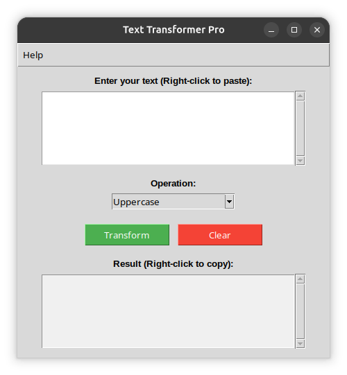

# 🔤 Text Transformer Pro ✨

A simple yet powerful desktop application for transforming text case with an intuitive interface and clipboard integration.

## ⚡ Features

- **Multiple Text Transformations** - Convert text between different cases
- **Clipboard Integration** - Copy results and paste text with right-click context menus
- **Real-time Preview** - See transformed text immediately
- **Clean Interface** - Simple, distraction-free design
- **Keyboard Shortcuts** - Right-click context menus for quick actions
- **Well-Tested** - Comprehensive test suite with pytest
- **Modern Architecture** - Clean separation of concerns (business logic + GUI)

## 📸 Preview


## 📥 Installation

### ✅ Prerequisites
- Python 3.6 or higher
- Tkinter (included with Python standard library)

### 📦 Install from Source

1. Clone or download the repository:
```bash
git clone https://github.com/EvgeniyPavlenko85/text-transformer-pro.git
cd text-transformer-pro
```

2. Install the package in development mode (optional but recommended):
```bash
pip install -e .
```

This will install the package and make the `text-transformer` command available.

### 🧪 Install Test Dependencies

To run tests, install the test dependencies:
```bash
pip install -e ".[dev]"
```

### 🚀 Run the Application

```bash
python -m text_transformer.gui
```

Or if installed:
```bash
text-transformer
```

## 📖 Usage

### 🛠️ Basic Workflow

1. **Enter Text**
   - Type or paste your text into the input area
   - Right-click in the input area and select "Paste" to paste from clipboard

2. **Select Operation**
   - Choose from four transformation options:
     - **Uppercase** - Converts all letters to uppercase (e.g., "hello" → "HELLO")
     - **Lowercase** - Converts all letters to lowercase (e.g., "HELLO" → "hello")
     - **Capitalize** - Capitalizes the first character (e.g., "hello" → "Hello")
     - **Title** - Converts to title case (e.g., "hello world" → "Hello World")

3. **Transform Text**
   - Click the "Transform" button or use the operation dropdown
   - The result will appear in the result area

4. **Copy Results**
   - Right-click in the result area and select "Copy"
   - Or select text manually and use standard copy shortcuts

5. **Clear Fields**
   - Click "Clear" to reset both input and result areas

### 📋 Context Menu Features

| Area | Right-click Options |
|------|-------------------|
| Input Area | Paste text from clipboard |
| Result Area | Copy text to clipboard |

## 🔄 Supported Transformations

| Operation | Example Input | Example Output |
|-----------|--------------|----------------|
| Uppercase | "Hello World" | "HELLO WORLD" |
| Lowercase | "Hello World" | "hello world" |
| Capitalize | "hello world" | "Hello world" |
| Title | "hello world" | "Hello World" |

## 🏗️ Building Standalone Executable

### 🔧 Using PyInstaller

1. Install PyInstaller:
```bash
pip install pyinstaller
```

2. Build the executable:
```bash
PYTHONPATH=src pyinstaller --onefile --windowed --name TextTransformer main.py
```

### 📜 Using Build Script
```bash
make pyinstaller
```

## 🧪 Testing

### Running Tests

Run all tests with coverage:
```bash
pytest --cov=src --cov-report=term-missing
```

Run only unit tests:
```bash
pytest tests/test_transformer.py -v
```

Run only integration tests:
```bash
pytest tests/test_gui.py -v
```

### Test Coverage

The project includes:
- **55 unit tests** for the transformation logic
- **10 integration tests** for GUI components
- **65 total tests**

## File Structure

```
text-transformer-pro/
├── src/
│   └── text_transformer/
│       ├── __init__.py       # Package initialization
│       ├── transformer.py    # Core transformation logic
│       └── gui.py             # GUI components
├── tests/
│   ├── __init__.py
│   ├── conftest.py           # Test fixtures
│   ├── test_transformer.py   # Unit tests
│   └── test_gui.py           # Integration tests
├── pyproject.toml           # Project configuration
├── main.py                   # Legacy entry point (kept for compatibility)
├── screenshot.png            # Application screenshot
├── Readme.md                 # This documentation
└── LICENSE.md               # License file
```

## System Requirements

- **Operating System**: Windows, macOS, or Linux
- **Python**: 3.6 or higher (for source code)
- **Memory**: 50 MB RAM minimum
- **Disk Space**: 10 MB for executable version

## Keyboard Shortcuts

| Shortcut | Action |
|----------|--------|
| Right-click (Input) | Paste from clipboard |
| Right-click (Result) | Copy to clipboard |
| Ctrl+C (Result) | Copy selected text (system shortcut) |
| Ctrl+V (Input) | Paste text (system shortcut) |

## Troubleshooting

### Text Not Transforming
- Ensure you have entered text in the input area
- Check that an operation is selected in the dropdown
- The result area might be disabled - this is normal behavior

### Copy/Paste Not Working
- Make sure you're right-clicking in the correct area
- Check that the clipboard contains text
- On some Linux systems, you may need to install `xclip` or `xsel`

### Application Doesn't Start
- Verify Python is installed: `python --version`
- Ensure Tkinter is installed: `python -c "import tkinter; print('OK')"`
- On Linux, you might need to install `python3-tk` package

## About

**Version:** 1.0.3  
**License:** Freeware  
**Author:** Pavlenko Evgeniy  
**Email:** pavlenkoevgeniy85@gmail.com  

Copyright © 2026

## Use Cases

- **Text Formatting** - Quickly convert text for documents and emails
- **Content Preparation** - Prepare text for web publishing
- **Programming** - Format code comments and strings
- **Data Entry** - Standardize text formats for databases
- **Academic Writing** - Ensure consistent text case in papers

## Contributing

Feel free to submit issues, feature requests, or pull requests on the GitHub repository.

### Ideas for Future Features
- **Word Count** - Display number of words and characters
- **Reverse Text** - Reverse the character order
- **Remove Extra Spaces** - Clean up whitespace
- **Find and Replace** - Search and replace text
- **Export to File** - Save results to .txt file
- **Batch Processing** - Process multiple text entries
- **Live Preview** - Transform text automatically as you type

## Changelog

### Version 1.0.3
- Updated version to 1.0.3

### Version 1.0.2
- Fixed GitHub Actions workflow for cross-platform builds
- Simplified artifact upload

### Version 1.0.1
- Refactored to proper package structure
- Added unit and integration tests
- Added GitHub Actions for cross-platform builds
- Added type hints and documentation

### Version 1.0.0
- Initial release
- Four transformation modes (Uppercase, Lowercase, Capitalize, Title)
- Copy and paste functionality via context menus
- Clean, simple interface
- Clear all fields functionality
- About dialog with program information

## License

This software is freeware. You are free to use it for personal or commercial purposes without charge. Distribution and modification are not permitted without explicit permission from the author.

## Support

For issues or questions:
- Email: pavlenkoevgeniy85@gmail.com
- GitHub Issues: [Create an issue](https://github.com/EvgeniyPavlenko85/text-transformer-pro/issues)

---

**Note:** This application is designed to run on Windows, macOS, and Linux platforms that support Python and Tkinter. The executable version is available for Windows users who don't have Python installed.